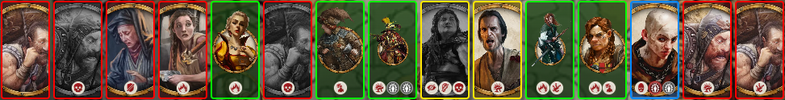
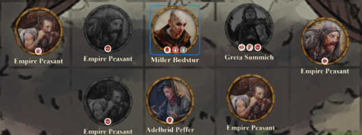

 

# Warhammer: The Old World - Combat Overlay

FoundryVTT module for combat overlay and automation helpers for Warhammer: The Old World Roleplaying Game.

## Top Panel

Functionality:
- Shows scene tokens as portrait cards for fast battlefield overview.
- Click a card to select/control its token on canvas.
- Shift/Ctrl-click keeps current multi-selection behavior.
- Double-click a card opens the actor/token sheet (when permitted).
- Supports drag-and-drop card reordering with per-scene saved order.
- Supports panel dragging/position memory (or locked/centered modes via settings).
- Displays contextual chip and portrait tooltips.

## Token Overlay

Functionality:
- Draws overlay labels directly on tokens, including configurable custom name labels.
- Supports top/bottom name placement with automatic scaling and hit-area updates.
- Provides token name/type tooltip support when enabled.
- Adds configurable hover/selection token border styling.
- Supports dead-token visual treatment when the `dead` condition is active.
- Keeps token interactivity aligned with overlay bounds for reliable hover/click behavior.

## Control Panel

Functionality:
- Shows focused data for the currently selected token/actor, including name, type, stats, and statuses.
- Provides one-click condition toggling from the status row.
- Supports wound controls: left-click adds wound, right-click removes wound, Shift+click rolls wound handling, Ctrl+click resets wounds to 0.
- Supports miscast dice controls: left-click +1, right-click -1, Shift+click rolls miscast (when available), Ctrl+click resets to 0.
- Provides action entries for combat flow, including `Defence`, manoeuvre/recover actions, and magic `Accumulate Power` flow when applicable.
- Includes tooltips and optional drag/drop customization for panel buttons, based on module settings.

## Settings

### Top Panel Settings

| Setting | Explanation |
| --- | --- |
| Enable Top Panel | Turns the top panel on/off globally. |
| Minimum Role | Limits who can see/use the top panel. |
| Card Drag/Drop Minimum Role | Controls who can reorder top-panel token cards. |
| Position Mode | Chooses panel behavior: free, locked, or always centered. |
| Drag Handle Side | Chooses drag handle placement (left/right) when free mode is used. |
| Status Row | Shows/hides status chip row on top-panel cards. |
| Statuses / Wounds / Temporary Effects Chips | Toggles each chip category shown on cards. |
| Show Dead Visual | Enables dead-state visuals in the panel. |
| Tooltips | Master toggle for top-panel tooltips. |
| Cards / Statuses / Wounds / Temporary Effects / Overflow Tooltips | Fine-grained tooltip toggles per top-panel content type. |

### Token Overlay Settings

| Setting | Explanation |
| --- | --- |
| Enable Overlay | Master toggle for token overlay features. |
| Minimum Role | Limits who can see/use token overlay enhancements. |
| Show Border | Enables hover/selection border styling on tokens. |
| Status Row | Shows/hides token status row. |
| Statuses / Wounds / Temporary Effects | Toggles each overlay chip category on tokens. |
| Show Custom Name | Enables overlay name label on token. |
| Name Position | Places overlay name label at top or bottom. |
| Show Dead Visuals | Enables dead-state token visual treatment. |
| Tooltips | Master toggle for token overlay tooltips. |
| Name / Statuses / Wounds / Temporary Effects / Overflow Tooltips | Fine-grained tooltip toggles for token overlay elements. |

### Control Panel Settings

| Setting | Explanation |
| --- | --- |
| Enable Control Panel | Turns the control panel on/off globally. |
| Minimum Role | Limits who can see/use the control panel. |
| Position Mode | Chooses panel behavior: free, locked, or always centered. |
| Enable Buttons Drag/Drop | Allows manual reordering of control panel buttons. |
| Status Row | Shows/hides status row in control panel. |
| Statuses / Abilities / Wounds / Temporary Effects | Toggles each status-row category in panel. |
| Portrait Block | Enables/disables portrait area. |
| Name / Image / Stats (Portrait Subsections) | Toggles each portrait subsection visibility. |
| Show Dead Portrait Status | Shows dead-state visual indicator on portrait. |
| Grid Buttons | Enables/disables action button grid. |
| Action / Weapons / Magic / Item Rarity Buttons | Toggles each grid button group. |
| Tooltips | Master toggle for control panel tooltips. |
| Show Tooltip Click Behavior Text | Shows/hides click-hint instructions inside tooltips. |
| Name / Stats / Statuses / Abilities / Wounds / Temporary Effects / Buttons Tooltips | Fine-grained tooltip toggles per panel element. |
