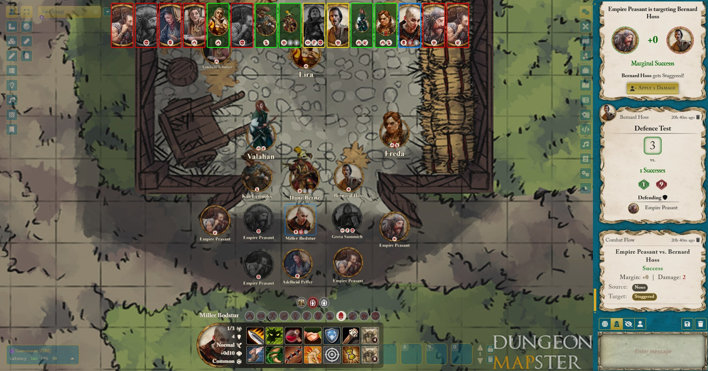
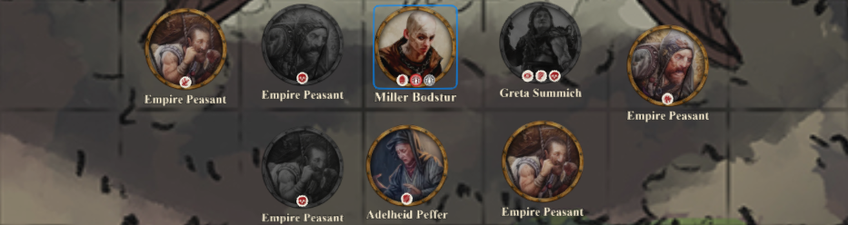
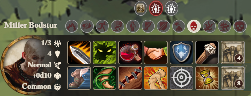
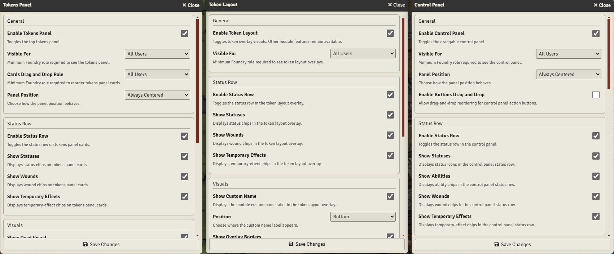

   

# Warhammer: The Old World - Combat Overlay

A FoundryVTT module that adds a combat overlay and automation helpers for Warhammer: The Old World Roleplaying Game

> Most features have been tested in GM mode, with more limited testing on the player side.
> Issues may still happen outside GM workflows. Please report any problems through GitHub Issues

## Controls

### Tokens Panel

The Tokens Panel provides a quick, readable view of everyone in the scene at the top of the screen. It makes switching between tokens much faster, and it can be arranged with saved order and panel position

### Token Layout

Token Layout adds lightweight visuals directly on tokens, so key information stays in place. Names, borders, and status elements are easier to read in busy scenes, and dead-state visuals help make the scene state clear at a glance

### Control Panel

The Control Panel keeps commonly used actor actions, attacks, and info in one place, reducing the need to jump between sheets. It is built for fast scene flow, including ranged weapon reload and common magic flows, with enough settings to fit different table preferences

## Settings

### Tokens Panel

| Setting | Explanation |
| --- | --- |
| Enable Tokens Panel | Toggles the top tokens panel |
| Visible For | Minimum Foundry role required to see the tokens panel |
| Cards Drag and Drop Role | Minimum Foundry role required to reorder tokens panel cards |
| Panel Position | Choose how the panel position behaves |
| Drag Button Position | Choose where the top panel drag button appears |
| Status Row Group | Shows or hides statuses, wound, and temporary effect chips on cards |
| Show Dead Visual | Applies dead-state styling to tokens panel cards |
| Tooltips Group | Controls tooltips visibility for cards, statuses, wounds, temporary effects, and overflow indicators |

### Token Layout

| Setting | Explanation |
| --- | --- |
| Enable Token Layout | Toggles token overlay visuals. Other module features remain available |
| Visible For | Minimum Foundry role required to see token layout overlays |
| Show Overlay Borders | Displays custom overlay borders on hovered or controlled tokens |
| Status Row Group | Shows or hides statuses, wound, and temporary effect chips on cards |
| Show Custom Name | Displays the module custom name label in the token layout overlay |
| Position | Choose where the custom name label appears |
| Show Dead Token Visuals | Applies grayscale dead-state styling to tokens with the dead condition |
| Tooltips Group | Controls tooltips visibility for cards, statuses, wounds, temporary effects, and overflow indicators |

### Control Panel

| Setting | Explanation |
| --- | --- |
| Enable Control Panel | Toggles the draggable control panel |
| Visible For | Minimum Foundry role required to see the control panel |
| Panel Position | Choose how the panel position behaves |
| Enable Buttons Drag-Drop | Allow drag-and-drop reordering for control panel action buttons |
| Enable Status Row | Toggles the status row in the control panel |
| Status Row Group | Shows or hides statuses, wound, and temporary effect chips on cards |
| Enable Portrait | Toggles the portrait section in the control panel |
| Show Name | Displays the selected token name on the control panel portrait |
| Show Image | Displays the selected token portrait image in the control panel |
| Show Stats | Displays the full stats block (wounds, resilience, speed, miscast dice) on the control panel portrait |
| Show Dead Portrait Status | Applies dead-state styling to portraits of selected tokens with the dead condition |
| Enable Grid Buttons | Toggles the control panel grid buttons area |
| Show Action Buttons | Enables manoeuvre, recover, and general action buttons in the control panel grid (excluding magic buttons) |
| Show Weapon Buttons | Enables weapon buttons in the control panel grid |
| Show Magic Buttons | Enables magic-related buttons in the control panel grid, including special magic and miscast actions |
| Show Items Rarity | Shows rarity-based visual accents on control panel item slots |
| Tooltips Group | Controls tooltips visibility for cards, statuses, wounds, temporary effects, and overflow indicators |

## License

This project is licensed under the [Apache License 2.0](https://choosealicense.com/licenses/apache-2.0/)
